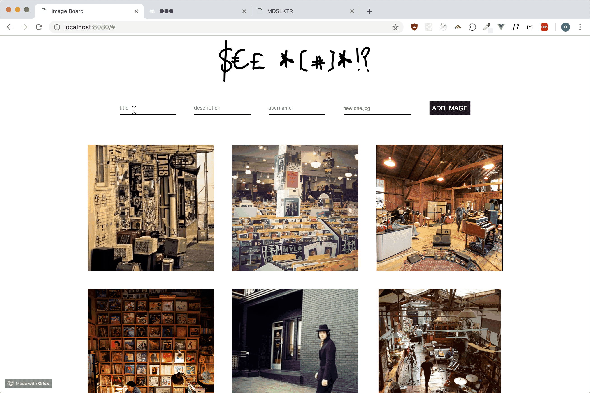
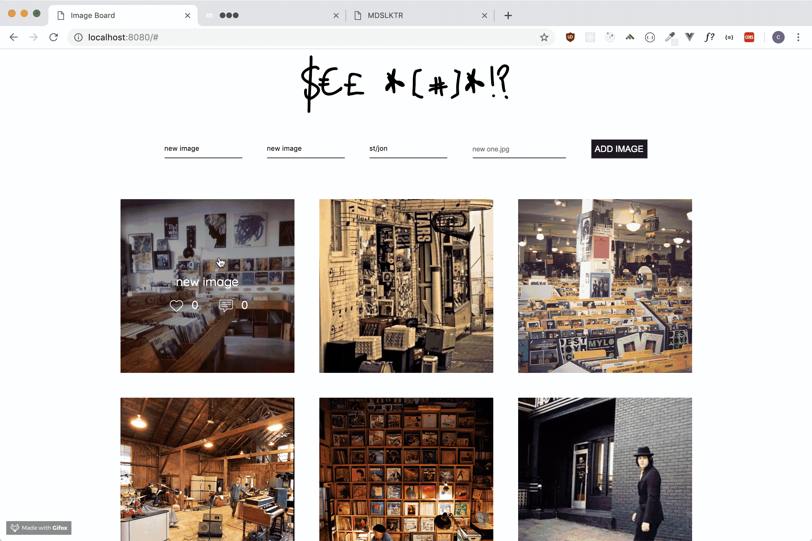

# ImageBoard

This is an Instagram clone that allow any user to upload picture, Every user can then comment and/or like the pictures.





## Getting Started

No registering or login for this one, you can simply choose your nicest picture and upload it to share it with the community



### Installing

to install the apllication on your local machine simply clone the repository to your local machine. 
create a new database and use the files from the SQL folder to create the tables.
Go to the root of your folder

```
npm install
```

then to start the server

```
node index.js
```


## Built With

* Vue.js
* JavaScript
* PostgreSQL
* CSS
* HTML

## Authors

* **Christophe Johanny** - *Initial work* - [st-jon](https://github.com/st-jon)

## License

This project is licensed under the MIT License - see the [LICENSE.md](LICENSE.md) file for details

## More Infos

* this website is fully responsive


